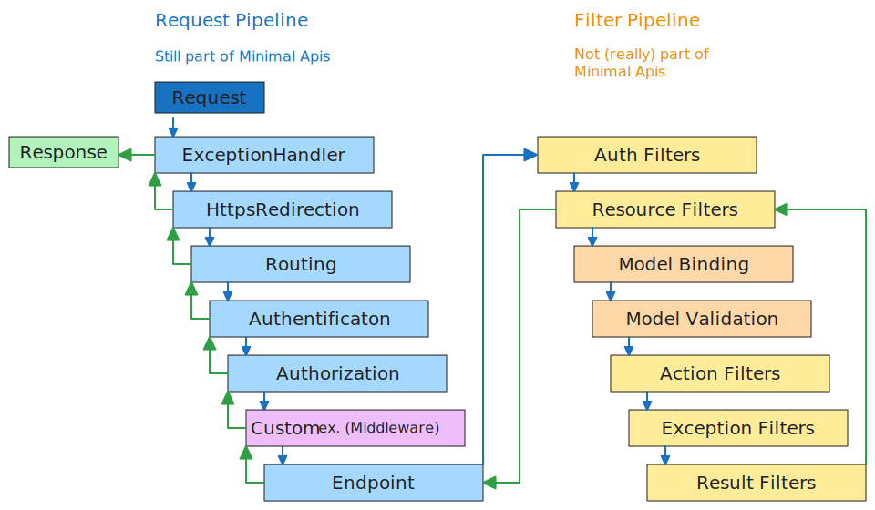

# Minimal Api compared to MVC

**MVC** - model-view-controller pattern. Is the old way of implementing apis in dotnet. Uses the controller model.

**Minimal APIs** - are architected to create HTTP apis with minimal dependencies. Ideal for microservices and apps that only include minimal files, features etc.


## MVC
splits program logic into three interconected elements.

- **Model** - Defines data structure (ex. the Class that shapes the JSON the users consume)
- **View** - Display of data (UI)
- **Controller** - maps requests to actions (handles routes like "/api" and what logic to call when it gets hit)

## Minimal Api
Leightweight, so some features are not supported out of the box (compared to mvc).

like:
- no model validation (by default)
- no support for JSONPatch
- no support filters
- no support for custom model binding(IModelBinder)

# The Differences

## What are Filters
Filters are not supported for Minimal Apis. (though could probably be created yourself with middleware?)

- Allow to run code before or after stages in the Filter Pipeline
- each Filter Type is executed at different times in the pipeline:
	- Auth
	- Resource
	- Action
	- Exception
	- Result

- Filters Can be scoped to:
	- Globally (all Controllers, all Actions etc.)
	- to a Controller
	- to an Action
- Filters can be synchronous or async.


## Custom Model Binding - IModelBinder
Allows Controller Actions to work directly with Model Types. (rather than http requests)

- doesnt seem terribly neccessary/useful to learn atm

## Model Validation
reports business rule errors. Ex. Input string length < min allowed length.

- Out of the box with Controllers. But can be added to minimal APIs.

`CommandCreateDto.cs`
```cs
namespace SixApi.Dtos{
	public class CommandCreateDto{
		[Required]
		public string? HowTo { get; set; }

		[Required]
		[MaxLength(7)]	// this is the part we can validate against
		public string? Platform { get; set; }

		[Required]
		public string? CommandLine { get; set; }
	}
}
```

- in a MVC we get a good concise error (no request will be made to sql-db) if we try to pass in a Create Request with a Platform string that is to long
- in the minimal-api a request will be made against the db, it will fail and a huge sql-error will come back to the client.
	- a simple way to catch those could be with a try catch to check for those errors 

## Patch endpoint
- a way to only update parts for an entry in our sql db. Like the HowTo-string without chaning the others.

```cs
[HttpPatch("{id}")]
public async Task<ActionResult> PartialCommandUpdate(int id, JsonPatchDocument<CommandUpdateDto>)
{
	var commandModelFromRepo = await _repo.GetCommandById(id);
	if (commandModelFromRepo == null) return NotFound();

	var commandToPatch = _mapper.Map<CommandUpdateDto>(commandModelFromRepo
	patchDoc.ApplyTo(commandToPatch);

	if (!TryValidateModel(commandtoPatch))
	{
		return ValidationProblem(ModelState);
	}
}
```