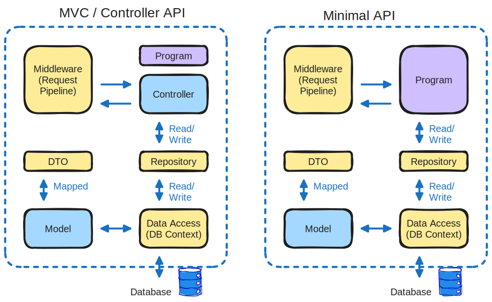

# Minimal Api compared to MVC

**MVC** - model-view-controller pattern. Is the old way of implementing apis in dotnet. Uses the controller model.

**Minimal APIs** - are architected to create HTTP apis with minimal dependencies. Ideal for microservices and apps that only include minimal files, features etc.



## MVC
splits program logic into three interconected elements.

- **Model** - Defines data structure (ex. the Class that shapes the JSON the users consume)
- **View** - Display of data (UI)
- **Controller** - maps requests to actions (handles routes like "/api" and what logic to call when it gets hit)

## Minimal Api
Leightweight, so some features are not supported out of the box (compared to mvc).

like:
- no model validation
- no support for JSONPatch
- no support filters
- no support for custom model binding(IModelBinder)


# Project
## Setup (no VS, only vscode)
Add libraries

```
dotnet new webapi -minimal -n SixMinApi
code -r SixMinApi                               //-r to open in same instance

dotnet dev-certs https --trust                  // generate self signed certs for 

dotnet add package Microsoft.EntityFrameworkCore
dotnet add package Microsoft.EntityFrameworkCore.Design
dotnet add package Microsoft.EntityFrameworkCore.SqlServer
dotnet add package AutoMapper.Extensions.Microsoft.DependencyInjection
```


For our server we create a `docker-compose.yaml`
```yaml
version: '3.8'
services:
  sqlserver:
    image: "mcr.microsoft.com/mssql/server:2019-latest"
    environment:
      ACCEPT_EULA: "Y"
      SA_PASSWORD: "pa55word!"
      MSSQL_PID: "Express"
    ports:
      - "1433:1433"
```

## Csharp Code

### Creating the Model
`/Models/Command.cs`

```cs
using System.ComponentModel.DataAnnotations;
namespace SixMinApi.Models
{
    public class Command
    {
        [Key]
        public int Id { get; set; }

        [Required]
        public string? HowTo { get; set; }

        [Required]
        [MaxLength(5)]
        public string? Platfrom { get; set; }
        
        [Required]
        public string? CommandLine { get; set; } 
    }
}
```
### Dtos
neccessary Dtos (for any operations supported). Ex. the `/Dtos/CommandCreateDto.cs`
```cs
using System.ComponentModel.DataAnnotations;

namespace SixMinApi.Dtos
{
    public class CommandCreateDto
    {
        [Required]
        public string? HowTo { get; set; }

        [Required]
        [MaxLength(5)]
        public string? Platfrom { get; set; }
        
        [Required]
        public string? CommandLine { get; set; } 
    }
}
```

### Data layer
#### The public config part
in `appsettings.Development.json` we do public configuration of our sql database.
```json
{
  // ... ,
  "ConnectionStrings": {
    "SQLDbConnection" : "Server=localhost,1433;Initial Catalog=CommandDb"
  }
}
```

#### The local(hidden) config part
setup dotnet user-secrets, this part stays in the local environment

```
dotnet user-secrets init
dotnet user-secrets set "UserId" "sa"
dotnet user-secrets set "Password" "pa55sword!"
```


#### code part
`/Data/AppDbContext.cs`

```cs
using Microsoft.EntityFrameworkCore;
using SixMinApi.Models;

namespace SixMinApi.Data
{
    public class AppDbContext : DbContext 
    {
        public AppDbContext(DbContextOptions<AppDbContext> options) : base(options)
        {
            
        }
        public DbSet<Command> Commands => Set<Command>();
    }
}
```

- dependency inject the db context into the api-app
```cs
/* dependency inject our Db context into the app: */
var sqlConBuilder = new SqlConnectionStringBuilder();

// add the public infro from the appsettings.Development.json to the builder.ConnectionString
sqlConBuilder.ConnectionString = builder.Configuration.GetConnectionString("ConnectionStrings");
// add missing info (hidden in our dotnet user-secrets) to the builder.ConnectionString
sqlConBuilder.UserId = builder.Configuration["UserId"];
sqlConBuilder.Passowrd = builder.Configuration["Password"];

// dependency inject this info into our builder -> app
builder.Services.AddDbContext<AppDbContext>(options => options.UseSqlServer(sqlConBuilder.ConnectionString));
```

#### entity framework setup db
```
dotnet ef migrations add initialmigration
// only if dotnet-ef cant be found we install it with: dotnet tool install 
--global dotnet-ef
```
If successful, Migrations folder will get created. Filled with code for sql commands fitting for the Dtos

Next we create the tables in our db:
```
dotnet ef database update
```